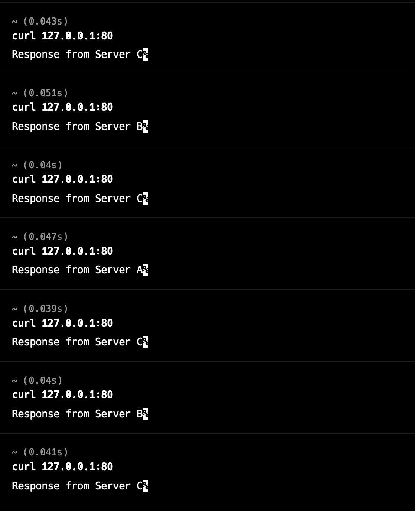

## Introduction

- This repo is the demo about round robin load balancer
- Setup with Node.js and Nginx
- Use in System design course at TechUp Thailand

## Instruction

1. Run `docker compose up --build`
2. Open another terminal and type `curl 127.0.0.1:80`
3. Observer the response from server (It should get response in round robin manner)

## Result

The load balancer distributes requests according to the weight assigned to each server:

- Server A: Weight 1
- Server B: Weight 2
- Server C: Weight 4

When sending 7 requests, the load balancer routes them in the following order:

`C -> B -> C -> A -> C -> B -> C`

This pattern aligns with the weights configured, where Server C handles the most requests, followed by Server B, and then Server A.

